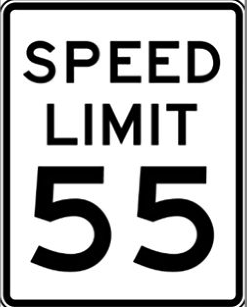

  <a href="../../stories.html">Stories</a> > <a href="../index.qmd">TOC Nos</a> > <strong>laws</strong>

::: {.post-nav}
[Next: 2.00 knowledge](../20250514_0200-knowledge/0200-knowledge.html) 👉
:::

Author: Chip Brock · Published: May 14, 2025

---

::: {.column-margin}
{ width=120px }
:::

# Turtles and Gasoline: Theory and Law

Here’s an oft-told story about turtles as the bedrock on which the universe is built. In arguing his plurality opinion in Rapanos v. United States, Justice Antony Scalia criticized Justice Kennedy’s argument in a footnote:

>   **Turtles**
>
>   "In our favored version, an Eastern guru affirms that the earth is supported on the back of a tiger. When asked what supports the tiger, he says it stands upon an elephant; and when asked what supports the elephant he says it is a giant turtle. When asked, finally, what supports the giant turtle, he is briefly taken aback, but quickly replies,  "Ah, after that it is turtles all the way down.”[^cwa] 

[^cwa]: This turtle story is also credited to Bertrand Russell, Carl Sagan, Linus Pauling, and many other scientists...and apparently justices.

When it comes to assertions about the universe by scientists, it’s theories, all the way down. 

I think that for many the popular notion of a Scientific Law is a statement that's impossible to dispute: once it’s discovered, it’s almost biblical in its permanence and trustworthiness. Once you’ve found a Law, man, you’re done. That’s it. It’s way better than a theory. Go do something else.

This idea of a Law was incorporated into the description of physics following Isaac Newton’s almost super-human successes. Surely, he’d uncovered the God-given Laws of Nature and surely uncovering the Laws of Nature is the goal of science! You’ll see all manner of “Laws” that follow Newton’s three Laws of Motion and Newton's Gravitational Law: Snell’s Law, The First and Second Laws of Thermodynamics, the Law of Reflection, Faraday’s Law, Ampere’s Law…and so on, up to the 20th century when we got serious. 

From that point, it’s Einstein’s Special Theory of Relativity, Einstein’s General Theory of Relativity, Quantum Theory, Ginzburg–Landau Theory, Bardeen-Cooper-Schrieffer theory, Relativistic Quantum Field Theory, Inflation Theory, the Big Bang Theory, and so on. Are we just dumber than when all of science was uncovering Laws? No, of course not. Rather, around the turn of the 20th century the subtlety of what science is was sinking in. But apparently not in Florida.

Let me tell you a story.

**The speed of light** 

We'll spend a lot of effort becoming comfortable with Einstein’s Theory of Relativity. One of its famous, bedrock rules is that the speed of light is the fastest that anything can travel. (BTW, that's a "postulate" not a law.) Relativity has been confirmed so many times that we use it as a tool and not a theory to be tested…Florida should call it the Law of Relativity. But we don’t. It’s the Theory of Relativity. 

>There is an elementary particle called the neutrino that is so light that it travels at almost the speed of light. In 2011 an experiment called Opera in a mountain in northern Italy was under way to measure properties of neutrinos coming from the particle accelerator in Geneva, Switzerland, almost 1000 km away.
>
>In order to be sure of the source of interactions, Opera had a sophisticated GPS system that measured times in Geneva and times in the mountain at a precision better than ±0.000000010 seconds (±10 nanoseconds). What they found was that the neutrinos appeared to arrive *faster* than the speed of light would allow, apparently violating the Theory of Relativity!
>
>If Relativity were a Law of Nature in the Florida-way, say the “Law of Relativity”—then the surprising Opera measurement  would have confronted the authority of the Law of Relativity and the scientists would back down. Can’t cross that threshold of Law. But scientists couldn’t do that. The experimenters worked very hard to redo their analyses and scoured their experimental apparatus for any place that the few nanoseconds might have been missing. 
>
>I was a member of the Physics Advisory Committee at the Fermi National Laboratory in Batavia, Illinois which was running a similar experiment, shooting neutrinos from Illinois to a mine in northern Minnesota. We asked them and learned that they too saw an effect, but they used a conventional GPS and they couldn’t measure times precisely enough to test Relativity… so we bought them a fancy – expensive – GPS system so they could check! Meanwhile many alternative explanations around Relativity were proposed to account for the measurement. Many, many. A small theoretical physics industry of alternative ideas.
>
>After a year or so, Opera discovered a subtle, tiny electronics malfunction that accounted for the missing few nanoseconds and then were able to conclude  that Einstein could rest easy. 

The important part of this story you surely have understood by now. Relativity is among the most trusted theories in all of science — if anything is “true” then this is it! And yet, when faced with an apparent problem,  we were willing to dig deeper.^[That's not to say that there weren't a number of physicists who decried it a waste of time to figure out the problem.]

 The authority of Relativity is not absolute, it’s not Law-like, but a highly trusted theory.

I was proud of my community during that episode. That’s how it’s supposed to work. There are no Laws of the capital L kind.

## My criterion for a proper scientific statement

This is treading into waters that force one to determine what is and what isn't proper the scientific process. Historically. that's the problem of demarcating Scientific Knowledge from "Pseudoscientific Knowledge." Here's my rule:

**In order for you to assert a statement about the natural world as legitimately scientific, you must be able to state what it would take to change your mind.**

Nobody said, “Let’s ignore this evidence because Relativity must be true.” We all said, “Wow. This is probably a mistake but we’d better spend a year around the world checking it.” 

Proponents of **scientific statements** can always tell you what evidence would force them to abandon one of their favorite theories, Here, a superluminal particle qualifies as one of those pieces of evidence that could in-principle have overthrown Relativity.

Proponents of **unscientific statements** cannot – or will not – do that. The most obvious contemporary example of unscientific assertions are those that come from creationism or "intelligent design." Unlike Opera, proponents of these systems of belief hold that some parts of their knowledge territory are off-limits for questioning. 

"X" cannot be doubted?  Then X may be some form of knowledge, but it's not scientific knowledge.

> **Wait.** Why shouldn’t students be taught both sides of such a disagreement about our origins?
>
> **Glad you asked.** That’s now called “teach the controversy“ and it’s not appropriate in a science class for two reasons. First, to put creationism in a science class goes against that crucial falsifiability requirement. So it’s not science. Second, science is not a democracy. There’s no requirement in how the universe works that it make people happy. It is what it is.

> **Wait.** What about Newton's Gravitational Theory! It's used today even to determine satellite and spacecraft trajectories.   
> **Glad you asked.** A tiny bit of display math can answer that I hope

Here is Newton's Gravitational law (see what I did there?):

$$F = G\frac{M_1M_2}{R_{12}}$$

In words, this formula says that the force of gravitational attraction between two objects that have masses of $M_1$ and $M_2$ and whose centers are separated by the distance $R_{12}$ is that relationship. Let's look at each piece:

- $G$ is called the gravitational constant (or Newton's constant). It's very hard to measure and as a resut it's the worst measured constant of nature of all. A question of scientific research today.
- $M$ is the mass...which is a very complicated thing. We are at work as we speak at CERN in Geneva, Switzerland trying to understand mass. A question of scientific research today.
- $R^2$ ...that "2" in the formula is a direct consequence of the presumption that we have three dimensions of space. It's a measurable quantity – and is not very precisely determined and the notion that we have three and not more spaciial dimensions is a question of scientific research today.

So every term in Newton's Gravatation law is uncertain and theoretically of interest. Again, Laws shouldn't do that. 

> **Wait.** So, what can you believe in?   
> **Glad you asked.** That's an understandable concern for folks who don't do science for a living. We have theories and they are all questionable. We must live in a world that is full of uncertainty and a scientific world where no idea is permanent. I suspect that's uncomfortable for many but it's our lives.

So "theories all the way down" really means that we have a few theories that we trust very well and we don't question them now unless a surprise happens. And we have many theories that are not trusted as much. So not turtles all the way down, but theories of varying degrees of trustworthiness.

In QS&BB we’ll work with the nuts and bolts of science: theories and models and this site will consist of the stories of how theories came to be, how they were modified, how they disappeared, and how we know so much more about the universe as a result.

---

::: {.post-nav}
[Next: 2.00 knowledge](../20250514_0200-knowledge/0200-knowledge.html) 👉
:::
