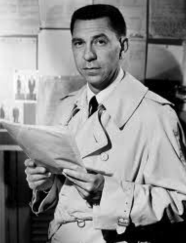

  <a href="../../stories.html">Stories</a> > <a href="../index.qmd">TOC Nos</a> > <strong>truth</strong>

::: {.post-nav}
👈 [Previous: 2.00 knowledge](../20250514_0200-knowledge/0200-knowledge.html) | [Next: 4.00 proof](../20250514_0400-proof/0400-proof.html) 👉
:::

Author: Chip Brock · Published: May 14, 2025

---

::: {.column-margin}
{ width=120px }
:::

Watch this space.

---

::: {.post-nav}
👈 [Previous: 2.00 knowledge](../20250514_0200-knowledge/0200-knowledge.html) | [Next: 4.00 proof](../20250514_0400-proof/0400-proof.html) 👉
:::
