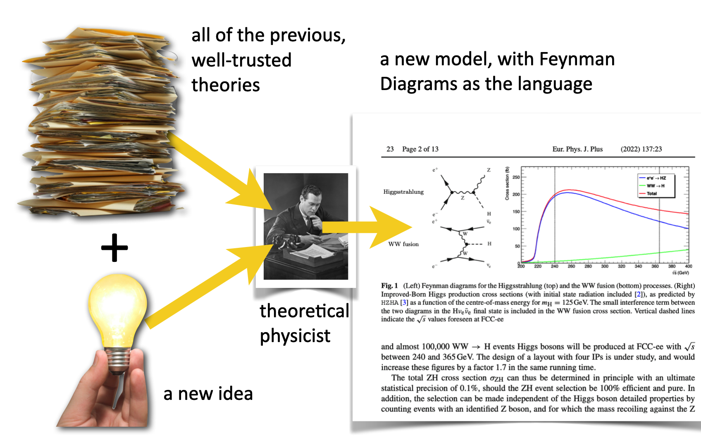

# What is a particle interaction?

## 1000 feet above

When any atoms, nuclei, or elementary particles encounter one another they might "interact." They might bounce off one another and continue on their way or they might crash into one another and become entirely different states of matter...or something in-between. 

Let's imagine what it means to "see"...what "interactions" are involved? When you look at at your blue suede shoe there are a variety. Visible rays of light – natural or artificial – are absorbed into the surface of your shoe and all are absorbed (a secondary electrochemical interaction) except those of rays of about 500 nanometers (blue!) in wavelength which: 1. bounce off the surface of your shoe, 2. pass through your cornea, 3. bang into your retina, 4. are absorbed in your eye's photoreceptors (rods and cones) where they electrochemically create currents  (electrons!) which travel through your optic nerve, and 5. finally interact in the cells of your brain's visual cortex. That's at least five interactions just to admire your boots, 

Every one of those interactions involves quantum particles of individual particles of light (photons) and particles of electricity (electrons). in this, and pretty much all of everyday life in your world it's photons and electrons.

> We know how to describe this. We can model it, we can predict the outcomes, and we can diagnose where the process misbehaves.

## On the ground

We have a language to describe processes like these, and frankly all others involving exotic particles beyond just photons and electrons. Same descriptive rules for modeling foot-gazing as for burning nuclei in the center of the Sun, as for the aftermath of a supernova explosion, as for the activity in the first picoseconds after the Big Bang. Same tools. Same mathematics. Same approach.

In this tutorial, I'll introduce the overall program, I'll show you the pieces, and help you to create stories of any particle interaction in the universe. It's both deceptively easy – and highly specialized and complex. In QS&BB, we'll do "easy."

> We tend to speak in words and we often reuse common words in ways that when we physicists are talking among ourselves, we understand. The word "energy" has a meaning to you, that might not be what we mean. Here's an important word that I'll use differently from even physicists: **Model**. 

