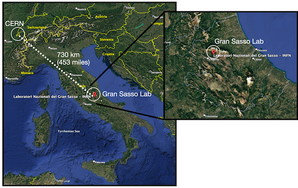
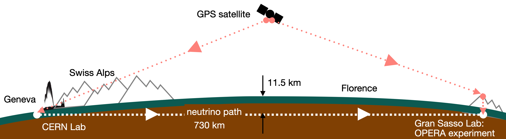

::: {style="font-size:0.85em; color:#555; margin-top:0.5em;"}
Author: Chip Brock · Published: May 17, 2025
:::

------------------------------------------------------------------------

Under Construction 🚧 👷‍♂️

# Measuring the speed of neutrinos

In **QS&BB** we'll spend a lot of effort becoming comfortable with Einstein’s Theory of Relativity. One of its famous, bedrock rules is that the speed of light is the fastest that anything can travel. (BTW, for Einstein that was technically a "postulate," not a law.) Relativity has been confirmed so many times that we use it as a tool and not a theory to be tested…Florida should call it the Law of Relativity. But we don’t. It’s the Theory of Relativity. (I mentioned this in \[laws\](/NOS/20250514_0100-laws/0100-laws.qmd) )

There is an elementary particle called the neutrino that is so light that it travels at almost the speed of light. In 2011 an experiment called OPERA (Oscillation Project with Emulsion-tracking Apparatus) in a mountain in the middle of Italy was under way to measure properties of neutrinos coming from the CERN particle accelerator in Geneva, Switzerland, almost 500 miles away.

## The experiment

The neutrinos are received after they've traveled 730 km from CERN, through a cord of the Earth. The laboratory in Italy is inside of a large mountain about 1400 meters high.

The experiment was designed to measure neutrino oscillations,[^1] a project done in multiple locations around the globe. But the scientists realized that they could make a measurement of the velocity of neutrinos very precisely. They made sure that they understood the distance from the source at CERN to the experiment (their "Geodesy campaign" determined that they knew the 730 km distance to a precision of 20 centimeters! This includes any geological movement of the crust. There was an earthquake in 2009 and the measurements of the crust movement were published.) and with a precise determination of when the neutrinos left CERN and when they arrived in Italy, the velocity could be measured.

[^1]: This is a measurement of neutrino properties of great importance...covered in a future post.

Here's a little animation to give you a sense of what the experiment does...buy imagining a footrace: <iframe src="opera-simulation-standalone-4.html" width="100%" height="2000px" style="border:none; border-radius: 8px;">

</iframe>

To do that, OPERA had a sophisticated GPS system that measured times in Geneva and times in the mountain at a precision better than ±0.000000010 seconds ($\pm10$ nanoseconds). The figure shows the GPS satellite communication with CERN and then to the top of the Gran Sasso mountain...and then down through the mountain almost 8000 meters to the electronics of the OPERA experiment.

What they found was that the neutrinos appeared to arrive *faster* than the speed of light would allow, apparently violating the Theory of Relativity! How much faster?

$$
v(\text{neutrinos})- c = 60.7 \pm 10 \text{ nanoseconds}
$$

They seemed to be traveling at 1.0000248 times the speed of light! Special Relativity cannot abide this. What do you do?

### Law of relativity?

If Relativity were a Law of Nature in the Florida-way ([laws](./../../trigger.qmd)) – say the “Law of Relativity” – then the surprising OPERA measurement would have confronted the authority of that Law of Relativity and the scientists would back down – can’t cross that threshold of Law. But OPERA scientists couldn’t do that. The experimenters worked very hard to redo their analyses and scoured their experimental apparatus for any place that the few nanoseconds might have been missing.

I was a member of the Physics Advisory Committee at the Fermi National Laboratory in Batavia, Illinois which was running a similar experiment, shooting neutrinos from Illinois to a mine in northern Minnesota. We asked them and learned that they too saw an effect, but they used a conventional GPS system and they couldn’t measure times precisely enough to test OPERA… so we bought them a fancy – expensive – GPS system so they could check! Meanwhile many alternative explanations around Relativity were proposed to account for the measurement. Many, many. A small theoretical physics industry of alternative ideas.

Look at the figure of the Earth's surface above...notice that the signal from the satellite lands on the top of the Italian mountain, and then nearly 8000 meters of cable runs down and around and through the laboratory. After a year or so, OPERA discovered a subtle, tiny, but flawed optical fiber seating that accounted for the missing few nanoseconds and then were able to conclude that Einstein could rest easy. Meanwhile, Fermilab had a shiny, new GPS system.

What did they say?

> "This result comes as a complete surprise," said OPERA spokesperson, Antonio Ereditato of the University of Bern. "After many months of studies and cross checks we have not found any instrumental effect that could explain the result of the measurement. While OPERA researchers will continue their studies, we are also looking forward to independent measurements to fully assess the nature of this observation."[^2]

[^2]: ScienceDaily, 23 September 2011. \<www.sciencedaily.com/releases/2011/09/110923084425.htm\>

And from CERN, who supplied the beam and of course were the source of some of the timing measurements:

> "When an experiment finds an apparently unbelievable result and can find no artefact of the measurement to account for it, it's normal procedure to invite broader scrutiny, and this is exactly what the OPERA collaboration is doing, it's good scientific practice," said CERN Research Director Sergio Bertolucci. "If this measurement is confirmed, it might change our view of physics, but we need to be sure that there are no other, more mundane, explanations. That will require independent measurements."[^3]

[^3]: ScienceDaily, 23 September 2011. \<www.sciencedaily.com/releases/2011/09/110923084425.htm\>

You get the important part of this story? Relativity is among the most trusted theories in all of science — if anything could be labeled as “Law” then this is it! And yet, when faced with an apparent problem, we had to dig deeper.[^4]

[^4]: That's not to say that there weren't a number of physicists who pooh-pooh'd it as a waste of time.

::: {.callout-note icon="false"}
📝 The authority of Relativity is not absolute, it’s not Law-like, but a highly trusted theory.
:::

Now, many in my community were very hard on the OPERA scientists, which I think was unfair. They measured something unusual, tried to kill that unusual result, could not, and so published it. I was at the original announcement at a CERN colloquium. It was straightforward. The last slide in the presentation said, "We do not attempt any theoretical or phenomenological interpretation of the results...We are not in a hurry. We are saying, tell us what we did wrong, redo the measurement if you can."

Here's the abstract from the original paper, *Measurement of the neutrino velocity with the OPERA detector in the CNGS beam*:

> The OPERA neutrino experiment at the underground Gran Sasso Laboratory has measured the velocity of neutrinos from the CERN CNGS beam over a baseline of about 730 km with much higher accuracy than previous studies conducted with accelerator neutrinos. The measurement is based on high-statistics data taken by OPERA in the years 2009, 2010 and 2011. Dedicated upgrades of the CNGS timing system and of the OPERA detector, as well as a high precision geodesy campaign for the measurement of the neutrino baseline, allowed reaching comparable systematic and statistical accuracies. An early arrival time of CNGS muon neutrinos with respect to the one computed assuming the speed of light in vacuum of (60.7 ± 6.9 (stat.) ± 7.4 (sys.)) ns was measured. This anomaly corresponds to a relative difference of the muon neutrino velocity with respect to the speed of light(v-*c*)/*c* = (2.48 ± 0.28 (stat.) ± 0.30 (sys.))×10-5.[^5]

[^5]: The paper has since been retracted and a new one submitted with the results following the optical fiber repair. The OPERA collaboration., Adam, T., Agafonova, N. et al. Measurement of the neutrino velocity with the OPERA detector in the CNGS beam. J. High Energ. Phys. 2012, 93 (2012). https://doi.org/10.1007/JHEP10(2012)093

Nothing breathless. Nothing grandiose. Just the facts. The experimenters did nothing wrong. Their analysis was proper. Their use of timing was proper, but unfortunately for them, there was a really hidden single point of failure in the timing circuit that led to an unaccounted for 60 nanoseconds of delay.

## The followup

Theoretical physicists got to work. Within a year, almost 200 theory papers were published explaining the faster-than-light neutrino within new models beyond Relativity. The stakes were high and a new beam was produced by CERN which greatly narrowed that broad proton timing distribution – in essence, beating the frequency of the drum of neutrino production faster and more precisely. Another experiment at CERN (ICARUS) was running and could make a comparable measurement. As I noted the Fermilab experiment which first had broad timing distributions made measurements with their new GPS system. Everything fell in line: Relativity was still not disconfirmed.

::: {.callout-important  icon=false}
🫵 I was proud of my community during that episode. That’s how it’s supposed to work. There are no Laws of the capital L kind.
:::

# The beam

[how proton accelerators make neutrino beams](/experiment-bios/neutrino_beams/neutrino_beams.qmd)

How accelerators produce neutrino beams varies according to capabilities, scientific need, and strategy. Beams are electrostatically and magnetically removed from the primary proton accelerator at a regular rate, related to the fact that the protons in the primary beam are bunched in small packets. The protons are sent to a target which produces unstable particles (pions) which decay in a long, evacuated pipe into neutrinos which then travel to the distant detector.

The time determination was not on an event by event basis, but a statistical one. In the original measurement the Super Proton Synchrotron delivered protons to the target in a "continuous" distribution which was 10 microseconds wide separated from one another by 50 milliseconds. Notice that the anomalous measurement was different by 60 *nanoseconds*. Within that broad distribution of protons' times when they created neutrinos, there were five peaks separated by 5 nanoseconds (corresponding to the accelerator's 200 MHz radiofrequency structure. Any proton in that long bunch could produce an interaction in the detector in a broad time window, relative to the difference measured.

The accumulated time stamps of each event were packaged into a probability distribution and shaped-wise compared with the known shape of the accelerator's proton distribution. The analysis of the results was done blindly – meaning that crucial parameters were hidden from the scientists (with one or two holding the key). When all of the timing and geodesy calibrations were done, then the unblinding was done so that actual times were for the first time revealed. The result must have terrified people. Either they had overturned Relativity or they had a long project ahead of them to understand it.