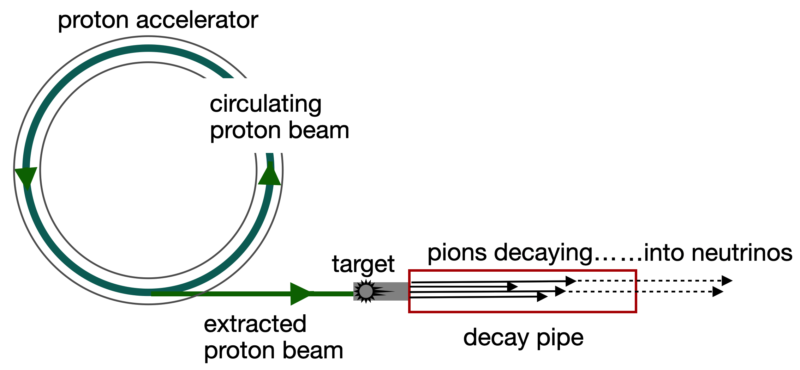

::: {style="font-size:0.85em; color:#555; margin-top:0.5em;"}
Author: Chip Brock · Published: May 17, 2025
:::

------------------------------------------------------------------------

In progress 🚧 👷‍♂️

## The apparatus and the beam

Neutrinos are odd characters. They're electrically neutral and related to charged cousins, like the electron. Whenever a neutrino appears, one of these others are around as well. What's really odd about them is how timid they are: when passing through matter their attention is very hard to get. They just pass through with a tiny, tiny probability of interacting with any of the particles in an atom. A silly way to characterize this (that we say all of the time) is that it would take a light-year's worth of lead to stop a neutrino. Right now as you read this, 100 x 100,000,000 (100 trillion or 100 million million) neutrinos from our Sun are passing through you without stopping. You're emitting neutrinos from the radioactive potassium and calcium in your body.

Neutrinos are incredibly light (we don't understand that) – they weigh less than 1 millionth the mass of an electron. So mass doesn't slow them down. As I said, they're electrically neutral, so they don't "see" the charges of atomic electrons or protons...so pass right by. And when they do interact it's through a very weak force called...well, we call it the Weak Force. They do so by most likely striking a proton or neutron and emitting one of their cousins, electrons or muons. And they do this at a strength that's 0.0002 times the strength of electricity.

So...I did my Ph.D. experiment scattering neutrinos from hydrogen atoms. Was my thesis full of blank pages? Nope. Full thesis. We used a lot of neutrinos.

### Neutrino beams

The [OPERA_experiment](./../OPERA/OPERA_experiment_neutrino_speed.qmd) neutrino beam produced roughly 10,000,000,000 neutrinos pre second. Each second, the OPERA detector recorded about 0.0003 interactions. So do the math: $$0.0003 \text{ events/second} \times 360 \text{ seconds/hour } \times 24 \text{ hours/day} = 2.5 \text{ events per day } $$

So how does this work?

The process relies on the properties of nuclear collisions and unstable particles.

The figure shows the five distinct components of the neutrino beam production cycle.

1.  The first neutrino beam was created at Brookhaven National Laboratory in 1962

------------------------------------------------------------------------