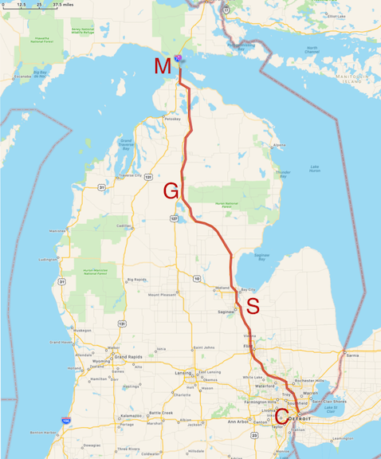
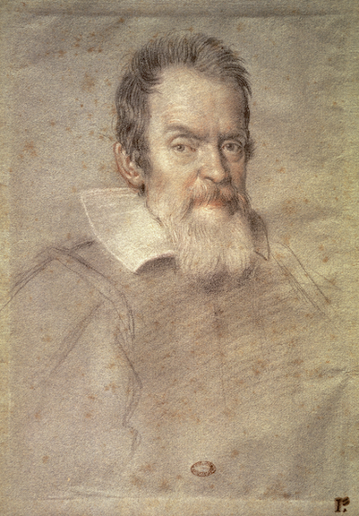
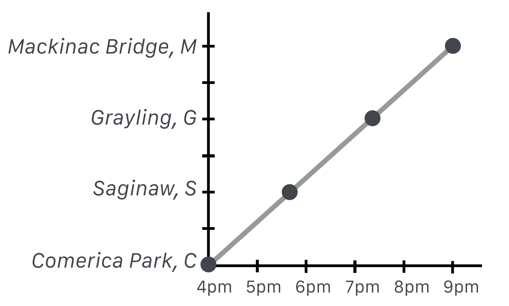

# Getting From Here to There: At Constant Speed

Motion is both the easiest and the hardest concept in physics and so much of what comes for us will constantly stretch at ideas about what motion is and how we can describe it. So we need to start at the beginning.

You've been dropping things since you were a toddler and you learned the hard way that if you drop something from a high place it will more likely break than from a low height. You learned that the harder you throw a ball, the faster it will leave your hand, the more damage it can do to a window, and the farther it will go before landing---and that it always comes down.

1. If time doesn’t march on, we’ve not moved. But what is time? “Tubby...paused. 'Time,' he added slowly -- 'time is what keeps everything from happening at once…" [^time] We'll see time take on a new meaning.
2. The final frontier, Space, is either “just there” or it’s a relationship among extended objects. If all of the things in the universe disappeared, is there space left over? That's an old, contentious issue and maybe was finally solved by Einstein.
3. What’s the difference between space and time? In “speed” they are just two sides of the same coin, or two sides of the same ratio. But don't you usually think of them as different things? One’s not more important than the other is it? Eventually, we'll let Einstein chime in here.
4. Particular speeds seem to be important. Mr. Galileo taught us about one and James Clerk Maxwell and Albert Einstein taught us about another. (There he is again.)


[^time]: This is often attributed to Einstein, Woody Allen, and John Wheeler! It actually comes from Ray Cummings' short story *The Time Professor* from 1921. Stick with me. You'll learn all sorts of odd facts.

From that simple word-equation, so sensible and so obvious, I've hinted at at least five complications. We have learned to ask simple questions and discover that they sometimes lead to important and surprising directions.

>**motion: it’s everywhere**<br>
>Almost everything in physics boils down to: motion. (Even boiling.)

Whether it’s runners on a track, the cosmic rays piercing us all the time, orbiting planets, electrons in a wire, electromagnetic waves, quark wavefunctions inside a proton, electrons and holes in a semiconductor, or the stretching of spacetime itself. Everything is about "motion."

These first lessons on the physics of my grandparents’ generation will establish the language and tools that we’ll need in order to pursue the more exotic forms of motion and we’ll become skilled at manipulating concepts (and their attendant symbols) like velocity, kinetic energy, mass, momentum, and force. Each of these terms has a sixteenth to nineteenth century origin, but each has managed to keep up with the times as layer upon layer of subtlety is discovered about each of them as we dig deeper and discover more.

But at its most basic, our physics will be all about how to get from <em>here</em> to <em> there</em> and from <em> then</em> to <em> now</em>, and to be able to explain how that happened and predict what will come next.

# Speed in Modern Terms

 Let’s make this more compact by inserting customary symbols to get rid of the English words. Here are some grammar rules in QS&BB:

-   We’ll limit ourselves almost exclusively to motion in one dimension
   in space.

-   We’ll use the symbol $v$ for speed (because customarily, we’ll speak
   of “velocity”…more about this below).

-   We’ll use the symbol $x$ for distance in one dimension, regardless
   of which direction it points.

-   We’ll use the symbol $t$ for time and almost always presume that we
   set our clocks so that the beginning time of any interval is
    $t_0=0$.

-   Oh, and we’ll use the subscript $\text{ }_{0}$ to indicate the beginning of some time or location interval---" $t_0$" or  " $x_0$ ”---in a sequence of events.

-   We’ll use the Greek symbol Delta, $\Delta$ to mean “change of”…this
   will come up a lot.

See. You already know a lot about motion. Let's go “up north.”

{width="200" height="267"}

{width="200" height="267"}

::: {.column-margin}
{width="200" height="267"}
:::


You see the various towns along the way and in this trip we'll be abstract in a couple of ways. That curvy line following the actual roads we'll pretend is just straight so we could define a coordate system with $x$ following the SE to NW path and in which $x=0$ is at Comerica Park. The second way we could abstract this scenario is to imagine that we're so good at the controls that we can drive at a constant 60 mph the whole way---no stopping, no slowing down or speeding up.

If our copilot got our her watch and wrote down the time that we breezed through Saginaw, Grayling, and when we got to the bridge she could create a graph which would look like this.

{width="200" height="267"}

It's a lot easier to use numbers rather than names and clock times so let's replace the names of the towns with their distances from the beginning and use decimal hours on the horizontal axis starting at the 4 o'clock point which we have the freedom to define to be $t_0 = 0$.

{width="200" height="267"}

That straight line in the distance plot is a familiar thing and we'll model that in Lesson 5. But there's a lot there. If we carefully made this plot before we left, then if asked, we could say how long it will take us to get to Grayling.

**Question!** So, how long will it take to get to Grayling at a constant 60 mph?

**Glad you asked.** I just follow the $y$ axis to the right from the 200 mi point until I hit the line and then read down from there and get: about three and a quarter hours.

**Good job!**

**Question!** The fact that the line of distance versus time is straight means what?

**Glad you asked.** No matter where we are on the graph (on the road!), the rate at which distance increases is the same anywhere along the way. From the park to Saginaw, it's $100$ miles/about $1.7$ hours which is about $59~$mph. From Saginaw to Grayling is $(200-100)/(3.3-1.7) = 100/1.6 = 63~$mph. The whole trip is $300/5=60~$ mph. I get the same thing everywhere.

So the straight line of distance versus time for a trip means that the speed is constnat.

**Good job!**

Now I don't know about you, but I can't drive precisely at 60 mph for 10 minutes, let alone for 5 hours. So here's a more realistic image of what the distance versus time relation might be.

{width="200" height="267"}

Here the dark line is meant to represent a more realistic journey with the light gray line showing the originally ideal, constant velocity trip. Notice that we start slow and speed up and then at Saginaw we stop for dinner: the distance is unchanged for almost an hour until point S2 when we start up again. And boy, do we ever. We fly through Grayling (G) on to Vanderbilt (V) and then more slowly, get to the bridge.

# Calculating a Speed

Some traditional jargon and nomenclature to make your…okay, *my* life easier. “Change” and “change-of” always means the difference between where you *are* as compared with where you *were*. Suppose I start out with \$100 and Janet gives me \$50. What's the net *change in* my net worth? We can represent this simple transaction as
$$\begin{align*}
\Delta(\text{my wealth}) &= \text{where I ended up} - \text{where I started} \nonumber \\
&= 150 - 100=50 \text{ ...so I'm up 50 bucks} \nonumber \end{align*}$$

which is the definition of our $\Delta$ : always "the end minus the beginning," the final value of some quantity minus the initial value of that quantity. Get it?[^start]

[^start]: So if class starts at 10:20 AM and if I were to fall asleep in mid-sentence at 10:50, it would be embarrassing.  When you posted my snoring image to Instagram you'd calculate that $t_0=10:20$ and $t=10:50$ and so you'd report that I managed to stay awake for $\Delta t=t - t_0 = 30$ minutes.

So let's apply this to physics and remember ... er, a double-remember from Section 3.2 where we defined speed:
  $$\text{speed} = \text{distance traveled divided the time that it took}$$
and made it into a simple equation:
  $$\text{speed}=\frac{\text{distance traveled}}{\text{time that it took}}.$$

So the numerator is a difference (so we'll use our difference symbol, $\Delta$) of where we ended up in space minus where we started in space: 
  $$\text{distance traveled in space }=\Delta x = x_{\text{ended up}}-x_{\text{where we started}}.$$
And the denominator is where we ended up in time minus where we started in time:
  $$\text{distance traveled in time }= \Delta t = t_{\text{ended up}} - t_{\text{where we started}}.$$
Lots of words, so we'll use some shorthand.

Using our standard notation in which the “initial state” of any quantity will be decorated with a little "0" subscript, like $x_0$ here. The “final state” will usually have no subscript and just be $x$.  So
  $$\Delta x = x_{\text{ended up}}-x_{\text{where we started}} = x-x_0$$
and
  $$\Delta t= t_{\text{ended up}}-t_{\text{when we started}} = t - t_0.$$ 
So our abstracted model for speed is:
  $$v = \frac{\Delta x}{\Delta t}.$$
Boy is Mr. Einstein going to make this interesting.


> **Sing along**
> Remember the rule. When you see the orange alert "**Pens out**!"  you should open your Notebook and copy what comes next until the orange stripe on the left stops. It's the path to your brain.

**The story of speed**

::: {.callout-warning title="Pens out!"}
Let's work it:

Given what we've done this far, using $\Delta$ notation in the numerator and denominator, we've said:

$$ \begin{equation}
v = \frac{\Delta x}{\Delta t} = \frac{x - x_0}{t - t_0}. 
\end{equation}$$

Often, we'll pretend that we can start our clock at the beginning of some event and so we can usually just let $t_0=0$ and then the symbol $t$ just stands for the time interval as well as the ending time. You'll see.

When you go somewhere, or predict how long it will take to get from one place to another, you would instinctively use an average speed to calculate it. For example, if you travel at a constant 60 mph for 5 hours, how far would you go? 

Get out your fingers and your toes for this calculation...it's $60 \times 5 = 300$ miles, right? You just did something important. Your brain already knows how to take {eq}`speed` and manipulate it a bit:

$$ \begin{align}
v &= \frac{\Delta x}{\Delta t} = \frac{x - x_0}{t - t_0} \\
v(t-t_0) & =x-x_0 \\
x-x_0 & =v(t-t_0)=(60)(5)=300 \text{ (miles)}.
\end{align} $$.
:::

> **More sing along**
> Sometimes when you see a different orange banner that says "**Please study Example 1**" or some other number, there's  an example for you to go through. You should follow the link and open your Notebook and copy what comes next. This example might be followed by a LON-CAPA question "**Please answer Question 1 for points.**"

```{admonition} &nbsp; Please study Example 1:
:class: warning

<a href="./../examples/motion/constantspeed_1_E1.html" target="_blank">moving at a constant speed </a>

```

```{admonition} &nbsp; Please answer Question 1 for points:
:class: danger

<a href="https://loncapa.msu.edu/tiny/msu/cQr0sN" target="_blank">More constant Speed </a>

```

### A Model for Motion

In that example, we've just created a model for motion, often an equation and a plot figure prominently in a model. In fact, since:

$$x = x_0 + \langle v \rangle (t - t_0)$$

is the equation for a straight line. Do you remember some time in your past algebraic life saying, "y equals m x plus b"  ...

$$y=mx + b?$$

Here, "$y$" is our distance, $x$; (briefly, confusingly) $x$ is our time difference, $t$; and $b$ (the slope in the equation) is our average velocity, $\langle v \rangle$.

So we can see that the straight line from our plots has a slope that's equivalent to our average speed. Now I don't know about you, but I can't drive precisely at 60 mph for 10 minutes, let alone for 5 hours. So here's a more realistic image of what the distance versus time relation might be.

{width="200" height="267"}


Here the dark line is meant to represent a more realistic journey with the light gray line showing the originally ideal, constant velocity trip. Notice that we start slow and speed up and then at Saginaw we stop for dinner: the distance is unchanged for almost an hour until point S2 when we start up again. And boy, do we ever. We fly through Grayling (G) on to Vanderbilt (V) and then more slowly, get to the bridge.

Let's analyze this while feeling sorry for ourselves about that speeding ticket.

```{admonition} &nbsp; Please study Example 2:
:class: warning

<a href="./../examples/motion/realistic_1_E2.html" target="_blank">realistic trip </a>

```

```{admonition} &nbsp; Please answer Question 2 for points:
:class: danger

<a href="https://loncapa.msu.edu/tiny/msu/f8KMF1" target="_blank">Real trip </a>

```

Can you see that the average speed is the same for the realistic trajectory and the originally idealistic steady-on-the-gas picture? All the average depends on is the beginning and the end.

> **Instantaneous speed**
>If you want to know more details, then you'd need shorter time intervals. In each successively smaller interval you'd know the speed more precisely and in the limit where you're just at a point on some curve of distance – well, that's the _instantaneous speed_. That too is an idealistic notion since any measurement of speed would require a finite time interval. Of course your speedometer is calculating an average also, but the time interval is so short that we tend to think of the reading in the cockpit as our speed *right now*.

```{admonition} &nbsp; Pens out!
:class: warning

So now we have a functional relationship that acts as a little calculating engine: you give me a time and a speed and your starting point, I'll reliably tell you your new position when your clock reaches that time. The world can be pretty neat that way. Here it is:

$$x = x_0+\langle v \rangle t$$

Often we'll be a little casual about the average sign and we'd just say

$$x = x_0+ v t.$$

```

>This is how we'll use models in QS&BB: sometimes an equation, but most times, a plot of an equation.

